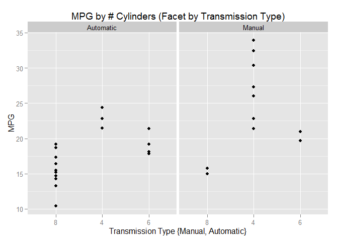
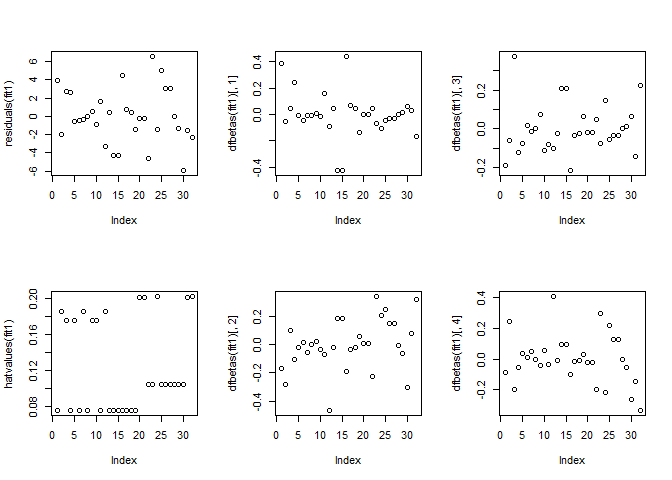
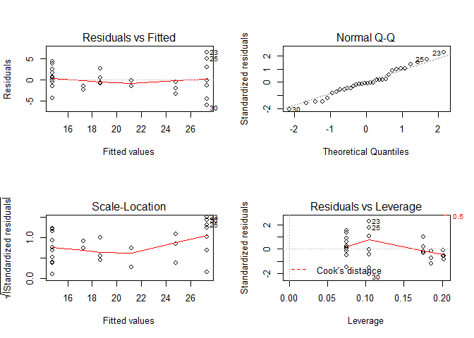

### Impact of Manual vs. Automatic Transmission on MPG  

#### Executive Summary / Synopsis:  

In this analysis, I looked at the "mtcars" Dataset.  The goal of this anaysis is to assess whether or not Transmission Type {Automatic, Manual} impacts MPG.  As part of this analysis, the impact of confounding factors, especially # Cylinders, on MPG is considered.  The results show that when not considering other factors, the choice of Transmission Type has an impact the MPG, but after considering at least one other confounding factor, # Cylinders, the impact is not as strong, but still present.  

#### Data Processing:  

Only a subset of the steps for Data processing are "echoed" here (see corresponding section in the Appendix for Data Processing), as are some of the exploratory data analysis calls (head, summary), in addition to consolidating some R statements due to the report length constraints.   The mtcars dataset is loaded, a lookup table for TransmissionType is created, the mtcars and the lookup dataset are joined via the merge command, and the Cyl columm is created into a Factor variable.  

#### Exploratory Graphs:  

Exploratory Graphs were created, with 3 generated in the Appendix under Heading "Appendix - Exploratory Graphs".  What is apparent from looking simply at "MPG vs. Transmission Type" is that Manual Transmission appears to have higher MPG than Automatics.  After adding a "color" to the graph for # Cylinders, it appears that the 4 cylinder cars tend to be higher in MPG tham the 6 or 8 cylinder cars, possibly implying a confounding factor.  Looking further by leveraging the "facet" argument to the qplot call, we see a clear dependency for # Cylinders and MPG in the "MPG vs. # Cylinders" graph with Transmission Type as a "facet"", but less of a clear dependency for Transmission Type in the "MPG vs. Transmission Type" graph with # Cylinders as a "facet" (i.e. accounting for a potential confounding factor).  Again, the 3 relevant Exploratory Graphs are in the corresponding section in the Appendix.  Regression Model and Results follow.  

#### Model / Results:  

From using a Linear Regression Model ("lm" in R), 3 fits were done:  MPG ~ Transmission, MPG ~ CYL, and MPG ~ CYL + Transmission.  From the Fit of MPG ~ Transmission, the Beta0 = 17.1, which relates the Expected Value of 17.1 MPG for a car with Automatic Transmission, while Beta1 = 7.2, which relates the Expected Value of 7.2 MPG increase or 24.3 MPG overall for a car with Manual Transmission - these results reflect that the choice in Transmission has an effect on MPG.    Similarly, from the Fit of MPG ~ CYL, the Beta0 = 15.1, which relates the Expected Value of 15.1 MPG for a car with 8 Cylinders, while Beta1 = 11.6, which relates the Expected Value of 11.6 MPG increase or 26.8 MPG overall for a car with 4 Cylinders vs 8 Cylinders, in addition to Beta2 = 4.6, which relates the Expected Value of 4.6 MPG increase or 16.2 MPG overall for a car with 6 Cylinders vs 8 Cylinders - these results reflect that the choice in # Cylinders has an effect on MPG.  

These two models are two different univariate models, with both showing a relationship between MPG and Transmission and MPG and # Cylinders.  Next, we consider a multivariate model.  from the Fit of MPG ~ Transsmision + CYL, the Beta0 = 14.7, which relates the Expected Value of 14.7 MPG for a car with 8 Cylinders qnd Automatic Transmission, while Beta1 = 10.1, which relates the Expected Value of 10.1 MPG increase or 24.8 MPG overall for a car with 4 Cylinders vs 8 Cylinders, in addition to Beta2 = 3.9, which relates the Expected Value of 3.9 MPG increase or 18.6 MPG overall for a car with 6 Cylinders vs 8 Cylinders, and in addition Beta3 = 2.6, which relates the Expected Value of 2.6 MPG increase or 17.3 MPG overall for a car with Manual Transmission vs Automatic Transmission - these results reflect that the choice in both Transmission and the # Cylinders has an effect on MPG.  

The model choice is Fit 1, where MPG ~ Transmission + CYL - while we are trying to model the relationship between MPG and Transmission, considering Transmission only would overstate the impact Manual Transmissions have vs. Automatic Transmissions.  Thus, # Cylinders is a counfounding factor, and once its impact on MPG is removed, we have a more accurate estimate of the impact of Transmission Type and MPG.  There may be other counfounding factors, but for the purpose of this analysis, the concept of multivariate regresion and the concept of considering other factors also impacting the relationship between variables you are trying to model, are considered.  Also, further analysis would most likely exceed the limited allowed length for this analysis.  

Lastly, if looking at summary statistics for each fit, each coefficient mentioned here is significant at a 95-99+% confidence level, that is for Fit 1, Fit 2, or Fit 3, either for 4/6/8 Cylinders or for Manual/Automatic with the exception of Fit 1 (the model chosen here), we would accept at a 90% (or technically at a 94.1% confidence level), as the p-value for this coefficient is 0.059.  Further, the adjusted R ^ 2 for the fits are 0.34 for Fit 1, 0.71 for Fit 2, and 0.74 for Fit 3 -- while not a perfect measure of fit, given the coefficient values, the p-values, and the R ^ 2 values, Fit 3 is chosen as it increases R ^ 2, while providing a 94.1% (or higher) confidence level for model coefficient significance.  

Per the question, Manual Transmission is better for MPG than Automatic, but # Cylinders is an example of another factor impacting the MPG for a given car.  Also, per the question, per the multivariate model choice (here, Fit1), the quantified difference between Manual and Automatic Transmissions is 2.6 MPG after accounting for the impact of # Cylinders.  

The residuals for Fit 3 is included in the Appendix.  From the residuals plot, there is no apparent pattern in the data.  From considering the dfbetas, a diagnostic measure of the model fit for the change in coefficients if a specified data point is removed, show no patterns when plotted in addition to having all values within the same order of magnitude.  Also in terms of hatvalues, which determines whether or not there are values that have significant leverage, there are no points that stand out.  WIth the Normal QQ plot, there does appear to be a slight pattern which may question the normality assumption.  

In terms of model uncertainty, confidence intervals can be created around the model (Fit 1) coefficients {Beta0, Beta1, Beta2, Beta3}.  95% CIs can be roughly created around each coefficient by the coeff +/- 1.96 * std error, which translates to:  Beta0 CI = 14.7 +/- 1.7, Beta1 CI = 10.1 +/- 2.8, Beta2 CI = 3.9 +/- 2.9, and Beta3 CI = 2.56 +/- 2.54.  
 
Please see the corresponding Appendix section entitled "Appendix - Model / Results".  

#### Appendix:  

#### Appendix 1: Data Processing:  

Data processing code, due to report Length Restrictions, is included here.

```r
library(ggplot2)

# load data 
data("mtcars") #head(mtcars) #summary(mtcars)

# Create a Lookup Table for Transmission Type & define factor columns 
Trans <- cbind( TransID = c(0,1), TransName = c("Automatic", "Manual"))
mtcars$cylFactor <- as.factor(mtcars$cyl)
mtcars <- within(mtcars, cylFactor <- relevel(cylFactor, ref = "8"))

# merge the datasets 
mtcarsTrans = merge(x = mtcars, y = Trans, by.x = "am", by.y = "TransID", x.all=TRUE)
```

#### Appendix 2: Exploratory Graphs:  

Exploratory Graphs, due to report Length Restrictions, are included here. 


```r
# Exploratory Graphs 
qplot(TransName, mpg, data = mtcarsTrans, color = cylFactor, 
      main = "MPG by Transmission Type (Color by # Cylinders)", 
      xlab = "Transmission Type {Manual, Automatic}", ylab = "MPG")
```

 

```r
qplot(TransName, mpg, data = mtcarsTrans, facets = .~ cylFactor,
      main = "MPG by Transmission Type (Facet by # Cylinders)", 
      xlab = "Transmission Type {Manual, Automatic}", ylab = "MPG")
```

 

```r
qplot(cylFactor, mpg, data = mtcarsTrans, facets = .~ TransName,
      main = "MPG by # Cylinders (Facet by Transmission Type)", 
      xlab = "Transmission Type {Manual, Automatic}", ylab = "MPG")
```

 

#### Appendix 3: Model and Results:  

Model and Results Code, due to report Length Restrictions, are included here. 


```r
## Model Results:  
fit1 <- lm(mtcarsTrans$mpg ~ mtcarsTrans$cylFactor + mtcarsTrans$TransName) 
fit2 <- lm(mtcarsTrans$mpg ~ mtcarsTrans$TransName) 
fit3 <- lm(mtcarsTrans$mpg ~ mtcarsTrans$cylFactor) 

coef(fit1); coef(fit2); coef(fit3)
```

```
##                 (Intercept)      mtcarsTrans$cylFactor4 
##                   14.734292                   10.067560 
##      mtcarsTrans$cylFactor6 mtcarsTrans$TransNameManual 
##                    3.911442                    2.559954
```

```
##                 (Intercept) mtcarsTrans$TransNameManual 
##                   17.147368                    7.244939
```

```
##            (Intercept) mtcarsTrans$cylFactor4 mtcarsTrans$cylFactor6 
##              15.100000              11.563636               4.642857
```

```r
par(mfcol = c(2,3)); plot(residuals(fit1)); plot(hatvalues(fit1)); plot(dfbetas(fit1)[,1]); plot(dfbetas(fit1)[,2]); plot(dfbetas(fit1)[,3]); plot(dfbetas(fit1)[,4]); 
```

 

```r
par(mfrow = c(2,2)); plot(fit1)
```

 

```r
summary(fit1) # summary(fit2); summary(fit3) 
```

```
## 
## Call:
## lm(formula = mtcarsTrans$mpg ~ mtcarsTrans$cylFactor + mtcarsTrans$TransName)
## 
## Residuals:
##     Min      1Q  Median      3Q     Max 
## -5.9618 -1.4971 -0.2057  1.8907  6.5382 
## 
## Coefficients:
##                             Estimate Std. Error t value Pr(>|t|)    
## (Intercept)                  14.7343     0.8421  17.498  < 2e-16 ***
## mtcarsTrans$cylFactor4       10.0676     1.4521   6.933 1.55e-07 ***
## mtcarsTrans$cylFactor6        3.9114     1.4703   2.660   0.0128 *  
## mtcarsTrans$TransNameManual   2.5600     1.2976   1.973   0.0585 .  
## ---
## Signif. codes:  0 '***' 0.001 '**' 0.01 '*' 0.05 '.' 0.1 ' ' 1
## 
## Residual standard error: 3.073 on 28 degrees of freedom
## Multiple R-squared:  0.7651,	Adjusted R-squared:  0.7399 
## F-statistic:  30.4 on 3 and 28 DF,  p-value: 5.959e-09
```

#### Appendix 4:  Specific Grading Criteria:  

Answers to the specific grading criteria is listed here.  

- Did the student interpret the coefficients correctly? -- Yes - The coefficients are explained in the Model and Results section.  
 
- Did the student do some exploratory data analyses? -- Yes - Exploratory Data Analysis was completed {head, unique, summary, etc.}, but some left out here due to Report Length Requirements.  Three specific graphs generated with the ggplot2 library using qplot:  "MPG by Transmission Type (Color by # Cylinders)", "MPG by Transmission Type (Facet by # Cylinders)", "MPG by # Cylinders (Facet by Transmission Type)".  

- Did the student fit multiple models and detail their strategy for model selection?  -- Yes - three Linear Regr3ssion Models were fit, MPG ~ Transmission, MPG ~ CYL, and MPG ~ Transmission + CYL, with MPG ~ Transmission + CYL determined to explain more of the varience in the data, and hence, the chosen model.   Please see Model and Results section for details.

- Did the student answer the questions of interest or detail why the question(s) is (are) not answerable? -- Yes - Per the question, Manual Transmission is better for MPG than Automatic, but # Cylinders is an example of another factor impacting the MPG for a given car.  

- Did the student do a residual plot and some diagnostics? -- Yes - Residual Plots, along with model diagnostics (hatvalues, dfbetas, Normal QQ plot) were completed and interpreted.

- Did the student quantify the uncertainty in their conclusions and/or perform an inference correctly? -- Yes - 95% Confidence Intervals were created for each model coefficient.  

- Was the report brief (about 2 pages long) for the main body of the report and no longer than 5 with supporting appendix of figures? -- Yes - the writeup itself was kept to <2 pages.  I had some technical difficulties shrinking 3 Exploratory Analysis Graphs, 2 Model Result Graphs, and some R Output, which increased the overall length.  In addition, I had some computer / setup difficulties and had to have knitr first compile to html and then print to PDF - the html version was formatted nicer.  In the Appendix, ~3 pp comprise the Exploratory Data Analysis Graphs (should be 1pp, but could not get formatted correctly), ~2 pp comprise the Model Results Graphs (should be < 1pp, but could not get formatted correctly), ~1 pp comprises the R script for reading in the data and performing the linear regression model (to be expected), and ~1pp with a guide to my answers to the grading criteria and how I answer it in this document - a guide to the reader.  Hopefully some consideration can be made for the fact that the writeup itself was <2pp as requested, and the appendix length was due primarily to technical difficulties.  

- Did the report include an executive summary?  -- Yes - An Executive Summary / Synopsis was provided at the beginning of the writeup.  

- Was the report done in Rmd (knitr)? -- Yes - This report was done written in an Rmd (knitr) file and converted to PDF.  
